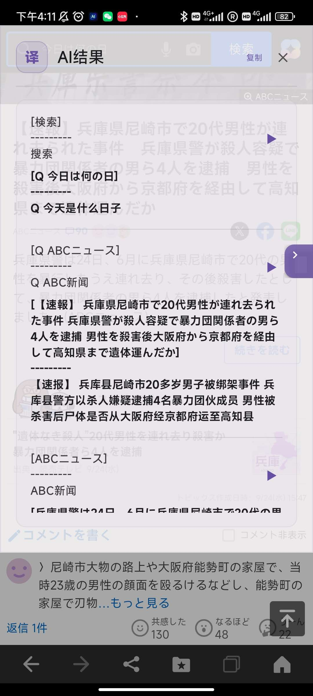
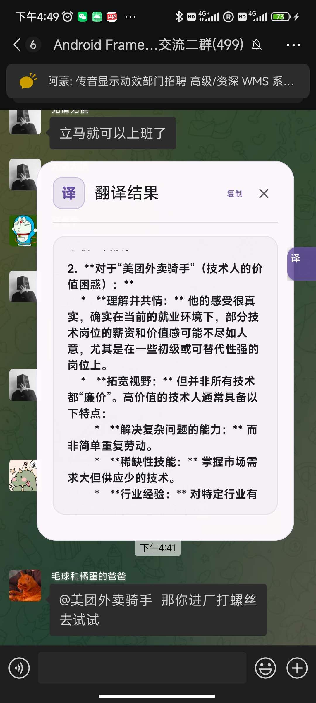
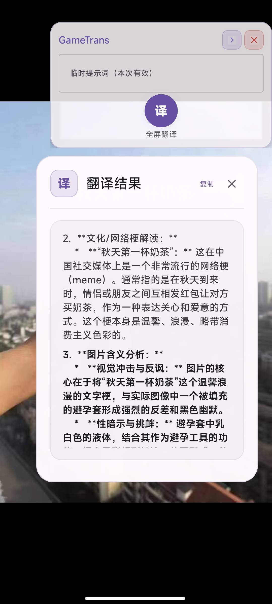
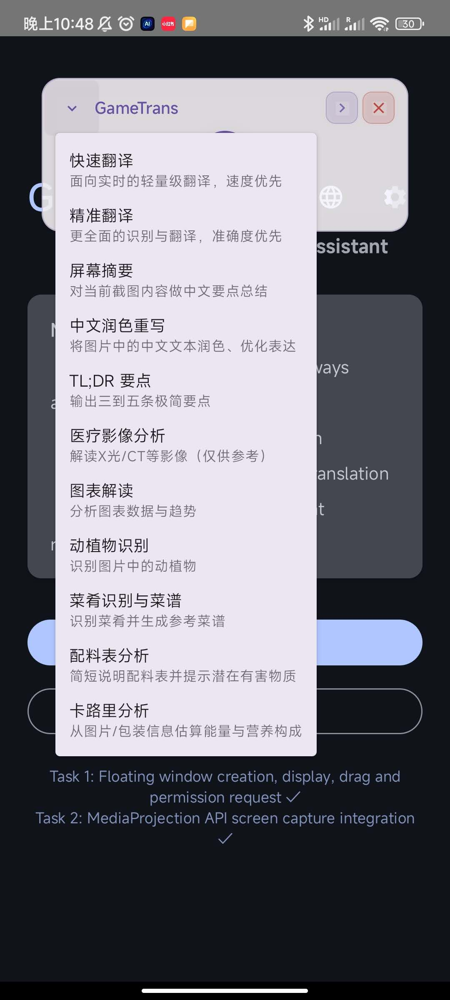

# GameTrans — An Android Overlay Translator & AI Assistant powered by Gemini
## 集成Gemini的Android悬浮窗翻译与AI助手

### 简体中文简介
本项目是一个基于 Android 的悬浮窗智能翻译与多场景图片理解应用，集成 Google Gemini 多模态能力。它支持一键截图并进行文字识别与翻译，结果通过悬浮面板展示；同时内置多种任务模板（如屏幕摘要、配料表分析、卡路里分析等），可快速对截图内容进行专业化的中文输出。应用提供设置面板用于调节提示词与图像优化参数，并支持对话模式（本地保存历史、长按复制单条消息）。

### English Overview
This is an Android overlay app powered by Google Gemini for multimodal translation and image understanding. It captures the screen with one tap, translates detected foreign texts, and displays results in an elegant overlay panel. The app also ships with multiple prompt templates (e.g., screen summarization, ingredients analysis, calorie analysis) to generate concise, Chinese-first outputs. A settings screen lets you tune prompts and image parameters, while the chat dialog supports local history persistence and long-press copy for individual messages.

---

## 关键特性 / Key Features
- **悬浮窗控制与前台服务**：常驻、可拖动、交互自然
- **一键截图与AI处理**：直接将截图与任务指令发送至 Gemini 模型
- **结果悬浮面板**：滚动阅读、复制、动画过渡、资源管理完善
- **设置中心**：提示词模式与图像优化（最大尺寸/压缩质量）即时生效
- **多场景任务模板**：翻译、摘要、配料表/卡路里分析等
- **对话模式**：本地保存历史、长按复制单条消息

- **Overlay Control & Foreground Service**: Persistent, draggable, and interactive.
- **One-Tap Screenshot & AI Processing**: Sends the captured bitmap and task prompt directly to the Gemini model.
- **Result Overlay Panel**: Features scrolling for long text, copy-to-clipboard, smooth animations, and robust resource management.
- **Settings Center**: Instantly applies changes to prompt modes and image optimization (max size/compression).
- **Multi-Scene Task Templates**: Handles translation, summarization, ingredients/calorie analysis, and more.
- **Chat Dialog**: Persists history locally and supports long-press to copy individual messages.

## 截图预览 / Screenshots
> 将下述四张图片放入 `docs/screenshots/` 目录，并命名为：
> `translate.png`, `wechat.png`, `news.png`, `task-menu.png`。
> 放置后，GitHub README 将自动展示。

<p align="center">
  
  
</p>
<p align="center">
  
  
</p>

---

## 主要使用场景 / Primary Use Cases

- **屏幕翻译 / Screen Translation**
  - 看新闻、玩游戏等场景时，对屏幕上的外语文本进行一键截图识别与翻译，结果通过悬浮窗即时展示。

- **基于屏幕内容的自定义提示词 / Custom Prompts from Screen Content**
  - 将当前屏幕截图与自定义中文/英文提示词一并发送至 Gemini，生成面向任务的输出（如要点摘要、专有名词解释、学习/攻略指引等）。
  - 可在设置中切换内置模板或输入自定义提示词；针对手机界面/游戏画面优化，输出以中文为先、简明清晰。

---

## 快速开始 / Quick Start
1.  在 Android Studio 中打开项目 (需要 Android 7.0+)。
2.  在 `local.properties` 文件中配置你的 API 密钥: `GEMINI_API_KEY=your_key`。
3.  同步、构建并在设备上运行。
4.  授予悬浮窗和屏幕捕获权限。
5.  点击悬浮窗按钮进行截图和处理；可在设置中切换不同的AI任务。
6.  使用对话窗口提问；历史记录会自动保存，长按消息可复制。

1.  Open the project in Android Studio (requires Android 7.0+).
2.  Configure your API key in the `local.properties` file: `GEMINI_API_KEY=your_key`.
3.  Sync, build, and run on a device.
4.  Grant the overlay and screen capture permissions.
5.  Tap the floating button to capture and process the screen; you can switch AI tasks in the Settings.
6.  Use the chat dialog for questions; history is saved automatically, and you can long-press a message to copy it.

---

## 开发日志摘要 / Development Log Summary

### Task 1: 悬浮窗 / Floating Window
-   **✅ 状态: 完成** / **Status: Complete**
-   **特性**: 权限处理 (`SYSTEM_ALERT_WINDOW`, `FOREGROUND_SERVICE`), 用于生命周期管理的前台服务 (`FloatingWindowService`), 以及使用 Jetpack Compose 构建的可拖动 UI。
-   **Features**: Permission handling, a foreground service (`FloatingWindowService`) for lifecycle management, and a draggable UI built with Jetpack Compose.

### Task 2: 屏幕截图 / Screen Capture
-   **✅ 状态: 完成** / **Status: Complete**
-   **特性**: 增强的权限管理 (`FOREGROUND_SERVICE_MEDIA_PROJECTION`), 使用 MediaProjection API 的 `ScreenCaptureManager`, 并与悬浮窗集成以触发截图。
-   **Features**: Enhanced permission management, a `ScreenCaptureManager` using the MediaProjection API, and integration with the floating window to trigger captures.

### Task 3: Gemini API 集成 / Gemini API Integration
-   **✅ 状态: 完成** / **Status: Complete**
-   **特性**: 用于处理图像翻译的 `GeminiApiManager`, 通过 `local.properties` 和 `BuildConfig` 进行的安全API密钥管理, 以及截图后触发的完整翻译流程。
-   **Features**: A `GeminiApiManager` for image translation, secure API key management via `local.properties` and `BuildConfig`, and a complete translation pipeline triggered after a screenshot.

### Tasks 4 & 5: 结果面板UI / Result Panel UI
-   **✅ 状态: 完成** / **Status: Complete**
-   **特性**: 采用 Material Design 3 风格的 `TranslationResultPanel` 组件，支持动画和长文本滚动。`TranslationPanelManager` 处理其生命周期和拖动手势。
-   **Features**: A `TranslationResultPanel` component with Material Design 3 styling, animations, and scrolling for long text. A `TranslationPanelManager` handles its lifecycle and drag gestures.

### Task 6: 设置界面 / Settings Screen
-   **✅ 状态: 完成** / **Status: Complete**
-   **特性**: 用于配置提示词模式 (优化、详细、自定义) 和图像参数 (最大尺寸、压缩质量) 的设置UI。`SettingsManager` 使用 `SharedPreferences` 持久化这些选项。
-   **Features**: A settings UI to configure prompt modes (Optimized, Detailed, Custom) and image parameters (max size, compression quality). A `SettingsManager` persists these choices using `SharedPreferences`.

### 优化与解决方案 / Optimizations & Solutions
-   **智能截图过滤**: 截图前自动隐藏翻译面板，避免其出现在截图中。
-   **质量改进**: 提高了默认图像尺寸和压缩质量以改善文本识别效果，并优化了提示词以提高准确性。
-   **问题排查**: 如果翻译不完整，用户可以切换到“详细模式”或在设置中提高图像质量。
-   **Smart Filtering**: The translation panel is now hidden before capturing the screen to prevent it from appearing in the screenshot.
-   **Quality Improvements**: Default image size and compression quality have been increased to improve text recognition, and prompts have been refined for better accuracy.
-   **Troubleshooting**: If translations are incomplete, users can switch to "Detailed Mode" or increase image quality settings.

---

## 多场景AI任务模板 / Multi-Scene AI Task Templates
`SettingsManager` 提供了多种内置提示词模板，可通过 `buildPrompt(task: AiTask)` 访问。

`SettingsManager` provides a variety of built-in prompt templates for different tasks, accessible via `buildPrompt(task: AiTask)`.

### 支持的任务类型 / Supported Task Types
-   **翻译 / Translation**
    -   `TRANSLATE_OPTIMIZED`: 快速翻译，速度优先 (Fast translation, prioritizing speed).
    -   `TRANSLATE_DETAILED`: 高精度翻译 (High-accuracy translation).
-   **内容创作与摘要 / Content Creation & Summarization**
    -   `SUMMARIZE_SCREEN`: 将屏幕内容总结为中文要点 (Summarizes the screen content into key points in Chinese).
    -   `REPHRASE_TO_CN`: 润色图片中的中文文本 (Polishes Chinese text from the image).
    -   `TLDR_KEYPOINTS`: 提取3-5个超简要点 (Extracts 3-5 ultra-concise key points).
-   **专业领域分析 / Domain-Specific Analysis**
    -   `ANALYZE_MEDICAL_IMAGE`: 医疗影像初步分析 (Preliminary analysis of medical images).
    -   `ANALYZE_CHART`: 解读图表，识别趋势与洞察 (Interprets charts to identify trends and insights).
    -   `INGREDIENTS_ANALYSIS`: 分析配料表并标记潜在有害物质 (Analyzes ingredient lists and flags potentially harmful substances).
    -   `CALORIE_ANALYSIS`: 从包装估算卡路里和营养信息 (Estimates calories and nutritional information from packaging).
    -   `IDENTIFY_PLANT_ANIMAL`: 识别动植物 (Identifies plants and animals).
    -   `IDENTIFY_DISH_AND_RECIPE`: 识别菜肴并提供示例食谱 (Identifies dishes and provides a sample recipe).

### 使用方式 / Usage
默认翻译流程不变。要使用特定任务提示词：
The default translation flow remains unchanged. To use a specific task prompt:
```kotlin
// 获取特定任务的提示词 / Get the prompt for a specific task
val settings = SettingsManager(context)
val prompt = settings.buildPrompt(AiTask.SUMMARIZE_SCREEN)

// 调用API时作为覆盖参数传入 / Pass it as an override when calling the API
val result = geminiApiManager.translateImage(bitmap, promptOverride = prompt)
```

### 设计原则与实践 / Design Principles
-   **统一入口**: 通过 `AiTask` 与 `buildPrompt(task)` 统一管理模板。
-   **低侵入**: 保留原有 `PromptMode` 与 `buildTranslationPrompt()` 以确保向后兼容。
-   **可扩展**: 新增场景仅需在 `AiTask` 与对应 `build...Prompt()` 中扩展。
-   **本地化**: 所有模板均以中文输出以优化体验。

-   **Unified Entry Point**: Manages all templates via `AiTask` and `buildPrompt(task)`.
-   **Low Intrusion**: Retains `PromptMode` and `buildTranslationPrompt()` for backward compatibility.
-   **Extensible**: Adding new scenarios only requires extending the `AiTask` enum and its corresponding `build...Prompt()` function.
-   **Localized**: All templates are designed to output in Chinese for the best user experience.

---

## 后期开发内容 / Roadmap

- **区域翻译 / Region-based Translation**
  - 在屏幕上框选一个或多个区域，进行更精确的 OCR 与翻译；支持缩放与质量优化，以适配游戏与长文档场景。

- **语音对话 / Voice Conversation (STT)**
  - 语音输入唤起对话窗口，实时语音识别（Speech-to-Text），并与模型进行多轮对话；适配免手动输入的使用场景。

- **TTS 朗读 / Text-to-Speech**
  - 对翻译结果、要点摘要等进行多语种 TTS 播报；提供语速、音色、音量等参数调节，便于边看边听。

- **Android 自动化研究 / Android Automation R&D**
  - 基于无障碍与自动化测试框架（如 UiAutomator/Espresso）探索自动点击、自动填表与流程驱动；结合 AI 指令生成操作脚本以提升可用性。

---

## 请我喝杯咖啡 / Buy Me a Coffee
如果这个项目对你有帮助，欢迎打赏一杯咖啡以支持后续开发与维护：

<p align="center">
  
  
</p>


